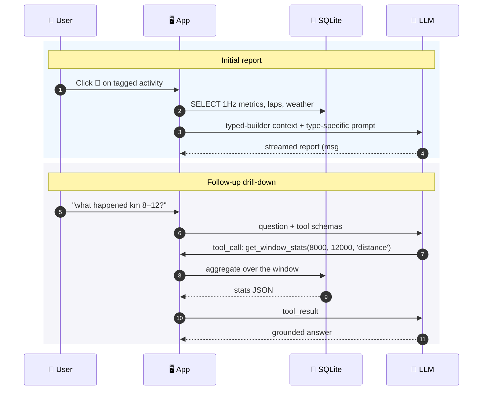
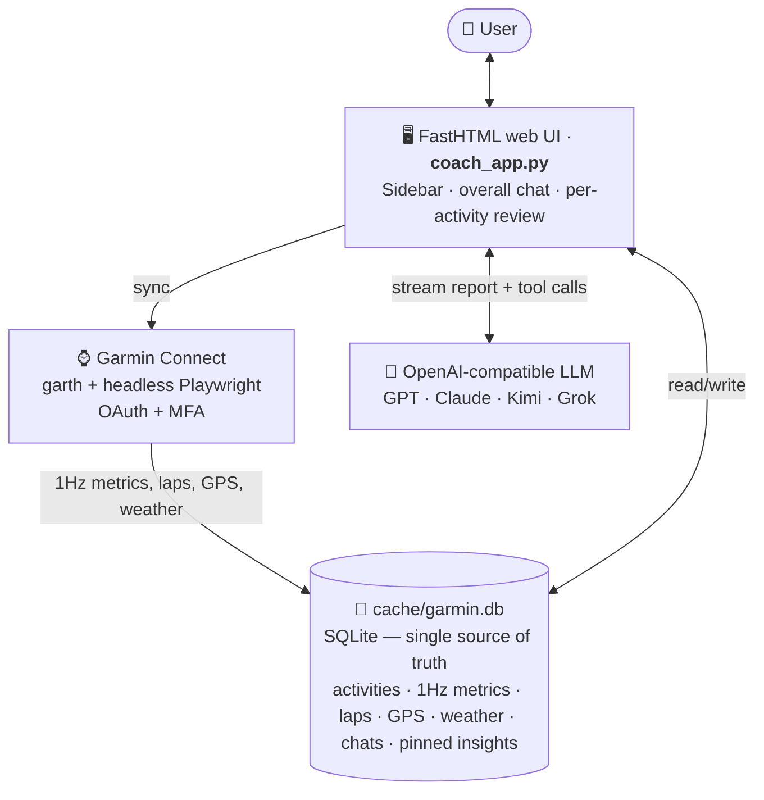
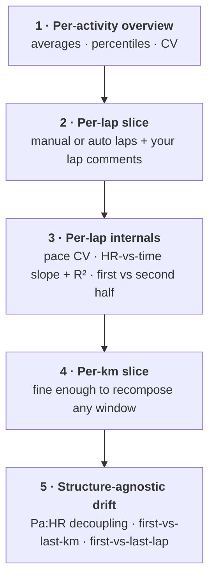

# 🛰️ tracing.run


[](LICENSE)


[](https://fastht.ml)
[](https://github.com/yuchong-li/tracing-run)

[Why](#why-i-built-this) · [What this is](#what-this-is--and-isnt) · [See it in action](#see-it-in-action) · [How it works](#how-it-works) · [Quick Start](#quick-start)

**English** | [中文](README.zh-CN.md)

> An AI-native, mobile-first training analysis tool for serious runners.
> Syncs from Garmin Connect, talks to you in English or 中文, runs on your own LLM.

*Built by serious runners. We use this every day.*

## Why I built this

I run, I use a Garmin watch, and I've spent years staring at Garmin Connect's wall of numbers and charts thinking *"this is useful data — but what do I actually change in my training?"*

[Intervals.icu](https://intervals.icu) is the best serious training analysis tool I know — but it's English-only, desktop-first, and pre-LLM. [Strava](https://www.strava.com) is a social feed — built for sharing runs with friends, not for digging into the data. [Sigma](https://sigma.run) is beautifully designed but optimised for casual check-in style runners. The Chinese mass-market apps (咕咚 / Keep / 悦跑圈) are aimed at the same casual crowd.

There's a gap: **serious Chinese-speaking runners** who train with intent, use Garmin / Coros / Suunto, and want depth in their pocket — in conversation form, not on a desktop dashboard.

So I built one. For myself first. Sharing it now, because I think other serious Chinese-speaking runners want the same thing — and nobody else is going to build it.

## What this is — and isn't

**This is for you if:**

- You train with intent — chasing a PB, building toward a race, breaking through a plateau
- You use Garmin (Strava / Suunto / Coros integrations are on the wishlist)
- You're comfortable with terms like Pa:HR, cardiac drift, ACWR — or curious enough to learn
- You want depth and honesty, not gamification

**This isn't for you if:**

- You want a social feed or running leaderboards → Strava is better
- You're new to running and want encouragement → Runna / Keep / 咕咚 are better
- You want a desktop multi-chart dashboard → [Intervals.icu](https://intervals.icu) is better
- You want a fully-automated training plan generator → maybe Runna + Strava

## Design principles

- **AI-native, not an AI afterthought.** The entire analysis pipeline is built around AI from day one.
- **Mobile-first.** Designed for "I just finished a run, what now?" moments — not for thirty-minute laptop deep-dives.
- **Your data, your LLM, your deployment.** Prompts live in `prompts/` as plain markdown. Data lives in your local SQLite. The LLM endpoint is yours to pick (OpenAI, Claude, Kimi, Grok, Ollama, …).
- **Multi-language peers.** Not translations of each other.
- **You know more about the run than the watch does.** Your tags and comments are ground truth; the watch's auto-classification is a hint.

## What I'm not building

To keep focus, the following are intentionally out of scope:

- ❌ Social feed, following, leaderboards
- ❌ Streak / beginner encouragement / gamification
- ❌ Desktop multi-widget dashboards
- ❌ Fully-automated training plan generation
- ❌ Connecting to Chinese-mainland-only data sources (咕咚 / Keep / 华为运动健康)

If you open an issue for one of these, I'll close it pointing here. Not because the idea is bad — because focus is the whole point.

## See it in action

### Desktop — the typed-builder review flow

<table>
<tr>
<td align="center"><b>1 · Pick the workout type for an activity</b><br/></td>
<td align="center"><b>2 · The typed builder produces a structured report</b><br/></td>
</tr>
</table>

### Mobile — where it's actually used

<table>
<tr>
<td align="center"><b>Sidebar — tagged activities by date</b><br/></td>
<td align="center"><b>Activity charts + follow-up chips</b><br/></td>
<td align="center"><b>The review report on a phone</b><br/></td>
</tr>
</table>

## Features

### 🏷️ Tags + comments — your ground truth

Two pieces of input from you decide how the rest of the pipeline behaves:

- **Workout-type tag** — picks the typed builder (Long Run / Tempo / Intervals / Hill / Trail / Race / Aerobic) and the matching prompt. An untagged activity falls through to a generic builder.
- **Activity comment** — your plan, intent, or felt experience (e.g. *"4×1km @ 4:00, rest 90s"* or *"hamstrings tightened up at hour 3"*). The builder aligns laps against your stated plan, and the LLM treats your words as ground truth whenever they contradict Garmin's auto-classification.

Skip them and you get generic numbers. Spend ten seconds tagging + commenting and the report tells you *which rep you cracked on and why*. The whole app rests on one assumption: **you know more about the run than the watch does** — your job is to tell it, its job is to do the math.

### 🔬 Per-activity review

Click any run in the sidebar. The app fetches the activity's full 1-Hz time-series (HR, pace, cadence, ground-contact-time, vertical oscillation, power, GPS, …), routes it through a **type-specific builder** (Long Run / Tempo / Intervals / Hill / Trail / Race / Aerobic), and produces a markdown report using a prompt tailored to that workout type.

The report itself is the first assistant message in a chat thread; follow-up questions continue in the same thread. The LLM has three drill-down tools scoped to this activity:

- **`get_window_stats(start, end, key_type)`** — aggregate statistics for an arbitrary window (HR mean / percentiles / drift slope, pace percentiles, cadence / GCT / VR / stride averages, grade buckets for trail). **Primary tool.** `key_type='time'` for seconds, `'distance'` for meters.
- **`get_raw_window_by_time`** / **`get_raw_window_by_distance`** — 1Hz raw points for cases where the shape of the time-series itself is meaningful (sprint finish or fade). Windows longer than 200 seconds are automatically downsampled to 3-6 second averages.

A question like "what happened between km 8 and 12?" gets a grounded answer, not a hallucination:



Any insight worth keeping can be retained via **📌**. Pinned insights are injected into the system prompt of every subsequent LLM call (overall chat and every review chat), so the coach doesn't forget context like a left-side ITBS history or downhill sensitivity.

### 💬 Cross-activity chat

The home page (`/chat/overall`) is a persistent chat thread with access to:

- Recent activities (last 90 days, including the manual tags, plans, and notes added on the review page)
- Six months of weekly aggregates
- Pinned long-term insights

It provides three cross-activity tools:

- **`find_activities(tag, name_contains, date_from, date_to)`** — resolves fuzzy descriptions like "last week's long run" or "last year's Melbourne marathon" into specific `activity_id`s
- **`get_activity_report(activity_id)`** — returns the full typed-builder report for a given activity (the same markdown shown on the 🔬 Debrief page). To compare two activities, invoke twice and diff the outputs
- **`get_metric_trend(metric, days)`** — per-activity or weekly trend series (VO2max, weekly km, training load, etc.)

So questions like "show me my Pa:HR trend across long runs this month" get answered without manual data stitching.

## How it works



### 🔐 Fetching from Garmin

`garmin_data.py` wraps `python-garminconnect` for the read API. The painful part is auth — Garmin requires OAuth1 + OAuth2 plus email/password and MFA. The implementation uses `garth` for the token exchange and **headless Playwright** to drive the email/password/MFA form on `sso.garmin.com`.

After the first login, OAuth tokens are written to `.garth_session/` and stay valid for ~12 months; subsequent syncs reuse them silently.

### 🧪 Activity-type-specific data pipeline

The same activity (say, a 25 km long run) means different things in different coaching frames. When 🔬 Debrief is clicked on a tagged activity, the dispatcher (`review_builders/__init__.py`) picks the **typed builder** that knows what matters for *that* workout type:

| Tag                  | Builder            | What it emphasises                                   |
|----------------------|--------------------|------------------------------------------------------|
| Long Run             | `LongRunBuilder`   | Pa:HR decoupling, first-km vs last-km mechanics      |
| Tempo / Threshold    | `TempoBuilder`     | cardiac-drift plateau, mid-set decoupling            |
| Intervals            | `IntervalBuilder`  | per-rep consistency, recovery-HR drop                |
| Hill                 | `HillBuilder`      | per-rep power decay, form-failure detection          |
| Trail                | `TrailBuilder`     | power × elevation overlay, downhill cadence          |
| Race                 | `RaceBuilder`      | distance-aware (5K / 10K / half / full sub-profiles) |
| Aerobic              | `AerobicBuilder`   | HR-ceiling breach, decoupling, form efficiency       |

Each builder reads the raw 1-Hz tier from SQLite, computes those metrics, and emits a markdown context block paired with the workout-type-specific prompt.

### 📐 Example: `LongRunBuilder`

Five layers, coarse to fine, so the LLM can tell a coherent story without tool calls — and drill deeper on demand:



What it deliberately doesn't pre-aggregate: framework-laden views like *front-15 vs back-15 mechanical decay* or *suspected push lap* labels. Those are interpretive choices — the builder hands the LLM the granularity to compute them correctly, the matching prompt supplies the framing.

The matching prompt (`prompts/{en,zh-cn}/review_report_long_run.md`) supplies:

- **Comparison frameworks** with the rule "one per claim, never mix" — e.g. first-km vs last-km mechanics deltas can't be read as economy when the pace zones don't match
- **Drill-down tool routing** — which of `get_window_stats` / `get_raw_window_*` to use for which type of follow-up
- **Formatting rules** — pace not m/s, the user's reference frame, integer HR / cadence / power

The other typed builders (`tempo`, `intervals`, `hill`, `trail`, `race`, `aerobic`) follow the same structure with different metrics — Hill focuses on per-rep power decay + form-failure detection (cadence drop, GCT spike near the summit); Intervals on per-rep consistency + recovery-HR drop; and so on.

### 💾 Storage

A single SQLite file at `cache/garmin.db` — activities, 1-Hz time-series, laps, splits, HR zones, GPS, weather, builder cache, all chat threads, races, pinned insights, application config. Mounted as `/data` so it survives container restarts.

### 🌐 Language

UI and coach responses are bilingual (English / Simplified Chinese). The locale is resolved per request:

> persisted DB choice → cookie → `Accept-Language` → `DEFAULT_LOCALE` env → default

Switching from a dropdown (login page or `⚙️ Settings`) writes both the DB and cookie; the entire UI re-renders in the new language on the next request.

The LLM side is locale-aware too: every typed-builder report has parallel prompts under `prompts/en/` and `prompts/zh-cn/`, and the loader picks the right one. Builders emit neutral-English context blocks; the prompt drives the output language.

**Adding a third locale = one `prompts/<lang>/` directory + one `i18n/<lang>.py` catalog** — no scanning Python sources for translatable strings.

## Quick Start

**Prerequisites**: Docker, a Garmin Connect account, and an OpenAI-compatible chat endpoint. Pick one:

| Option         | Base URL                               | Notes                                           |
|----------------|----------------------------------------|-------------------------------------------------|
| OpenAI         | `https://api.openai.com/v1`            | use your `sk-...` key                           |
| LiteLLM proxy  | `http://host.docker.internal:4000/v1`  | route Claude / Kimi / Grok / etc. via one key   |
| Ollama (local) | `http://host.docker.internal:11434/v1` | free, runs models locally, any key string works |

`setup.sh` asks for the base URL + key, plus a login password and your display name.

```bash
git clone https://github.com/yuchong-li/tracing-run.git
cd tracing-run
./setup.sh                 # interactive — sets display name, login password, LLM endpoint
docker compose up -d
open http://localhost:8507
```

On first launch the app asks for the login password (set during setup), then your Garmin email/password/MFA. Once the initial full sync completes, ~90 days of activities are ready to talk about.

## Stack

- **UI**: [FastHTML](https://fastht.ml) (single file, htmx, server-side rendering, SSE streams for LLM responses)
- **Garmin**: [python-garminconnect](https://github.com/cyberjunky/python-garminconnect) + [garth](https://github.com/matin/garth) + headless Playwright (for OAuth/MFA handling)
- **Storage**: SQLite (single file)
- **LLM**: any OpenAI-compatible endpoint — defaults to a local LiteLLM proxy
- **Deploy**: docker-compose

## A note on contributing

This is a personal project I'm sharing — not a community-governed product. I'm happy to receive PRs and issues, especially:

- Bug reports with reproduction steps
- New typed builders for workout types I haven't covered (steeplechase? race-walking? you tell me)
- Locale additions (`prompts/<lang>/` + `i18n/<lang>.py`)
- Prompt-tuning suggestions from your own training experience

Less likely to land:

- Features in the [What I'm not building](#what-im-not-building) list
- Large architectural changes (this app is small on purpose)

When in doubt, open a discussion before a big PR.

## License

[MIT](LICENSE). Use it, fork it, run it for yourself or your team. If you turn it into a hosted service, no obligation to share back — but I'd love to hear about it.
