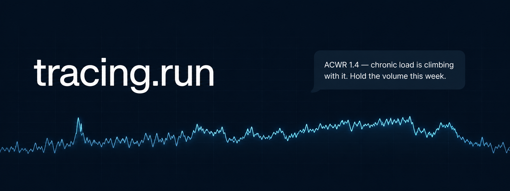
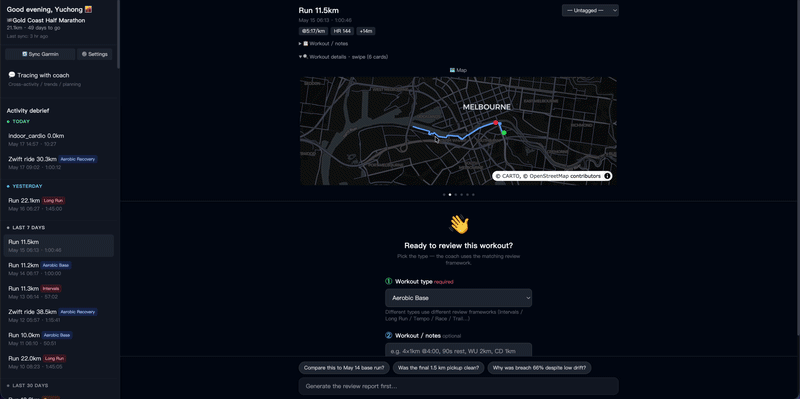
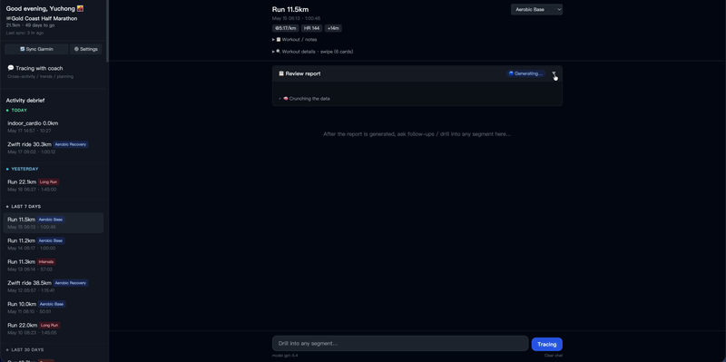
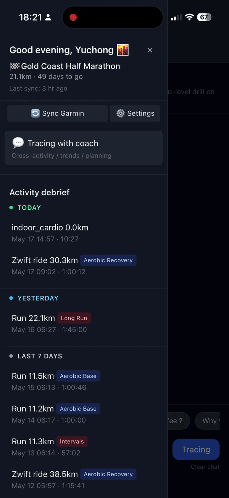
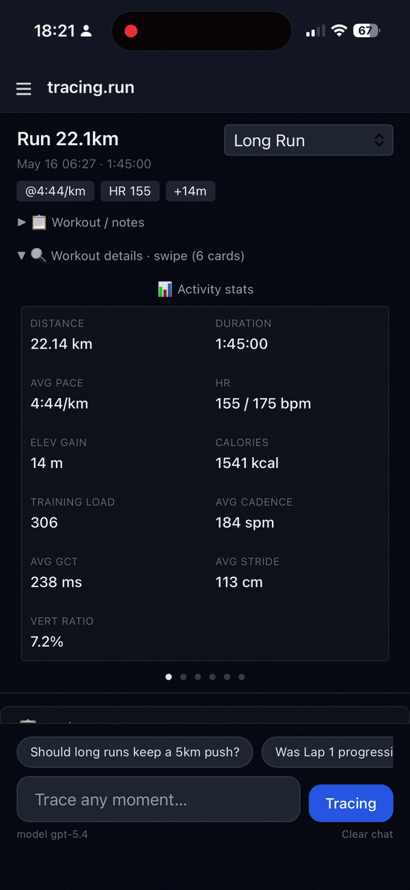
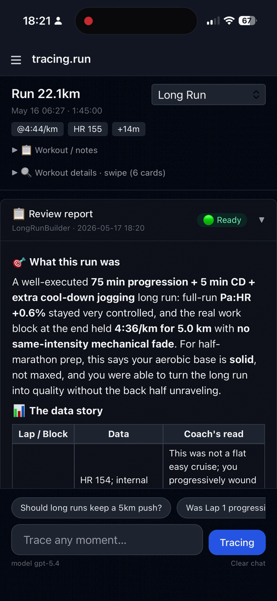
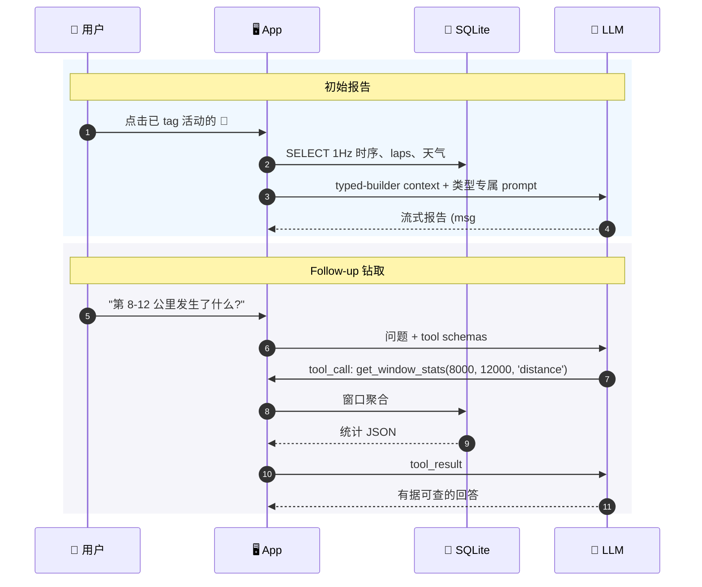
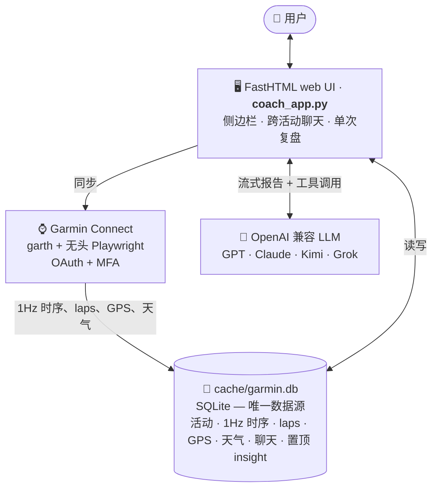
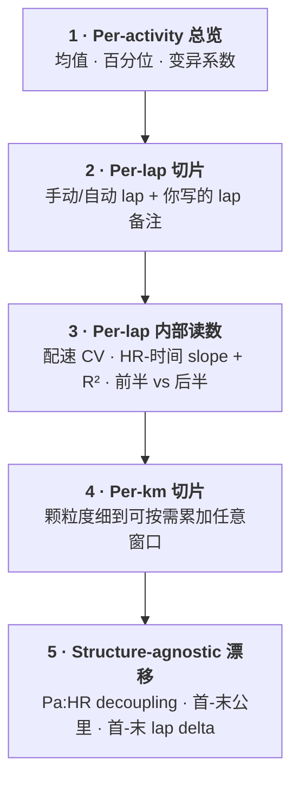

# 🛰️ tracing.run



[](LICENSE)


[](https://fastht.ml)
[](https://github.com/yuchong-li/tracing-run)

[为什么写这个](#为什么写这个) · [这个适合谁](#这个适合谁) · [实际效果](#实际效果) · [如何工作](#如何工作) · [快速开始](#快速开始)

[English](README.md) | **中文**

> 一款 AI-native、手机优先的训练分析工具, 给认真训练的跑者。
> 从 Garmin Connect 同步, 中英文双语对话, 跑在你自己的 LLM 上。

*Built by serious runners. We use this every day.*

## 为什么写这个

我跑步, 我戴 Garmin。多年来打开 Garmin Connect, 看着满屏密密麻麻的数字和图表, 我心里就一个问题: *"数据当然有用 —— 可我训练里到底要改什么?"*

[Intervals.icu](https://intervals.icu) 是我见过最专业的训练分析工具, 但它只有英文、桌面优先, 也诞生在 LLM 之前。[Strava](https://www.strava.com) 更像跑者的朋友圈, 用来分享, 不是用来做数据分析。[Sigma](https://sigma.run) 视觉精致, 面向的却是打卡型休闲跑者。咕咚 / Keep / 悦跑圈, 服务的也是这同一群轻度用户。

中间留着一片真空: **认真训练的中文跑者** —— 有目标、用 Garmin / Coros / Suunto, 想在口袋里随时拿到深度分析, 以对话形式, 而不是桌面 dashboard。

所以我自己写了一个。先给自己用。现在拿出来分享, 因为其他认真训练的中文跑者大概也想要同样的东西 —— 没人会替我们做。

## 这个适合谁

**适合你, 如果你**:

- 训练有明确目标 —— 冲 PB / 备赛 / 突破瓶颈
- 用 Garmin (Strava / Suunto / Coros 集成在 wishlist 上)
- 熟悉 Pa:HR、cardiac drift、ACWR 这类词, 或者愿意去学
- 想要的是深度与诚实, 而不是 gamification

**不是给你的, 如果你**:

- 想要社交 feed 或排行榜 → Strava 更合适
- 跑步新手, 需要的是鼓励 → Runna / Keep / 咕咚 更合适
- 想要桌面多图表 dashboard → [Intervals.icu](https://intervals.icu) 更合适
- 想要全自动训练计划生成器 → maybe Runna + Strava

## 设计原则

- **AI-native, 不是 AI afterthought。** 整个软件的分析逻辑都是围绕AI打造的。
- **手机优先。** 为"刚跑完, 现在怎么办"那一刻而设计, 不是给你 30 分钟坐在笔记本前慢慢拆。
- **你的数据, 你的 LLM, 你的部署。** Prompt 是 `prompts/` 下的纯 markdown。数据在你本地的 SQLite。LLM endpoint 你自己选 (OpenAI / Claude / Kimi / Grok / Ollama 都行)。
- **多语言平级。** 不是谁翻译谁。
- **你比手表更懂这次跑。** 你写的 tag 和备注是 ground truth, 手表的自动分类只是一个提示。
- **永远在线, 历史都在。** 你可以早上 6 点出门前问, 也可以晚上 22 点跑完问。它已经知道你过去 90 天的训练, 用你自己的数据回答 —— 不用每次重新交代背景。

## 不做什么

为了保持专注, 以下事项明确不在范围:

- ❌ 社交 feed、关注、排行榜
- ❌ Streak / 新手鼓励 / gamification
- ❌ 桌面多 widget dashboard
- ❌ 全自动训练计划生成
- ❌ 接入大陆专属数据源 (咕咚 / Keep / 华为运动健康)

为这些开的 issue, 我会指回这里然后关掉。不是想法不好 —— 是这个 App 做得小, 才能做得深。

## 实际效果

### 桌面端 —— typed-builder 复盘流程

<table>
<tr>
<td align="center"><b>1 · 给活动选择训练类型</b><br/></td>
<td align="center"><b>2 · typed builder 生成结构化复盘报告</b><br/></td>
</tr>
</table>

### 移动端 —— 真正常用的地方

<table>
<tr>
<td align="center"><b>侧边栏：按日期分组的已 tag 活动</b><br/></td>
<td align="center"><b>活动图表 + follow-up 建议</b><br/></td>
<td align="center"><b>移动端复盘报告</b><br/></td>
</tr>
</table>

## 功能概览

### 🏷️ Tag + 备注 —— 你提供的 ground truth

来自你的两条输入决定了后面整条管线的走向:

- **训练类型 tag** —— 选择 typed builder (Long Run / Tempo / Intervals / Hill / Trail / Race / Aerobic) 及对应的 prompt。未 tag 的活动落入通用 builder。
- **活动备注** —— 你的课表、意图或主观感受 (例: *"4×1km @ 4:00, 间歇 90s"* 或 *"第 3 小时大腿开始紧"*)。Builder 按你写的课表对齐 lap 数据; 当你写的内容与 Garmin 的自动分类冲突时, LLM 把你的话视为 ground truth。

不填: 拿到一份通用的数字报告。花十秒 tag + 写备注: 报告会告诉你*哪一组掉了链子、为什么*。整个 App 的前提只有一条: **你比手表更懂这次跑** —— 你负责告诉它, 它负责算明白。

### 🔬 单次复盘

在侧边栏点击任意一次跑步。应用会拉取该次活动完整的 1Hz 时序 (心率 / 配速 / 步频 / 触地时间 / 垂直振幅 / 功率 / GPS 等), 交由**对应训练类型的 builder** (Long Run / Tempo / Intervals / Hill / Trail / Race / Aerobic) 处理, 并以该类型专属的 prompt 生成一份 markdown 复盘报告。

报告本身就是该聊天线程的首条 assistant 消息。后续追问沿用同一线程。LLM 配备三个针对本次活动的钻取工具:

- **`get_window_stats(start, end, key_type)`** —— 任意窗口的聚合统计 (HR 均值 / 百分位 / 漂移斜率, 配速百分位, cadence / GCT / VR / 步距均值, 越野场景的 grade 块)。**主力工具**。`key_type='time'` 按秒, `'distance'` 按米。
- **`get_raw_window_by_time`** / **`get_raw_window_by_distance`** —— 1Hz 原始点, 适用于时序形状本身具有意义的场景 (如末段冲刺还是 fade)。超过 200 秒会自动降采为 3-6 秒平均。

因此"第 8 至 12 公里发生了什么"得到的是有据可查的回答, 不是 hallucination:



任意值得保留的 insight 可通过 **📌** 置顶。置顶的 insight 会注入所有后续 LLM 调用的 system prompt (跨活动聊天与每个复盘聊天), 让教练不会忘记你左侧 ITBS、下坡会加重症状这种关键信息。

### 💬 跨活动聊天

主页 (`/chat/overall`) 是一条持久化聊天线程, 可访问:

- 最近 90 天的活动 (含你在复盘页面手动添加的 tag、课表与备注)
- 6 个月的周粒度汇总
- 你置顶的长期 insight

它配备三个跨活动工具:

- **`find_activities(tag, name_contains, date_from, date_to)`** —— 把"上周长距离"、"去年墨马"这类模糊描述解析成具体的 `activity_id`
- **`get_activity_report(activity_id)`** —— 取出某次活动完整的 typed-builder 报告 (与 🔬 复盘页所见 markdown 一致)。要对比两次活动, 调用两次后做 diff
- **`get_metric_trend(metric, days)`** —— 按活动或按周的趋势序列 (VO2max、周跑量、training load 等)

所以"看一下我这个月长距离的 Pa:HR 趋势"无需手动拼接数据。

### 🌐 Web 搜索 —— 当数据不够用的时候

两类聊天都还有一个 `web_search(query)` 工具, 后端是 [Tavily](https://tavily.com)。教练自己决定什么时候调 —— system prompt 引导它优先用于训练方法学问题、横向对比 (*"我这 VO2max 在 30 岁男跑者里算什么水平"*)、装备、伤病康复方案、它可能不知道的近期研究 —— 同时刻意避开你自己的数据已经能回答的问题。

引用源会附 URL。Tavily 免费档每月 1000 次搜索, 个人用足够。不填 `TAVILY_API_KEY` 就关掉这个工具, 教练会说"搜不了", 不会编。

## 如何工作



### 🔐 从 Garmin 获取数据

`garmin_data.py` 封装 `python-garminconnect` 作为读 API。最复杂的部分是认证 —— Garmin 要求 OAuth1 + OAuth2, 并需邮箱密码与 MFA。本项目用 `garth` 完成 token 交换, 用**无头 Playwright** 在 `sso.garmin.com` 上模拟邮箱/密码/MFA 表单提交。

首次登录后, OAuth token 写入 `.garth_session/`, 有效期约 12 个月; 后续同步会静默复用。

### 🧪 按训练类型分流的数据管线

同一次活动 (比如 25 km 长距离) 在不同教练框架下含义不同。点击 🔬 复盘时, dispatcher (`review_builders/__init__.py`) 根据 tag 选择对应的 **typed builder** —— 每种 builder 都知道该类型里什么最值得看:

| Tag                | Builder            | 强调指标                                              |
|--------------------|--------------------|-------------------------------------------------------|
| 长距离             | `LongRunBuilder`   | Pa:HR decoupling、首公里 vs 末公里力学 delta          |
| 节奏 / 阈值        | `TempoBuilder`     | cardiac-drift 平台、主段内 decoupling                 |
| 间歇               | `IntervalBuilder`  | per-rep 一致性、间歇 HR 回落                          |
| 爬坡               | `HillBuilder`      | per-rep 功率衰减、形态崩溃检测                        |
| 越野               | `TrailBuilder`     | 功率 × 海拔 overlay、下坡 cadence                     |
| 比赛               | `RaceBuilder`      | 距离自适应 (5K / 10K / half / full 子档)              |
| 有氧               | `AerobicBuilder`   | HR 上限突破、decoupling、形态效率                     |

每个 builder 从 SQLite 读取 1Hz 原始时序, 计算上述指标, 输出一段 markdown context, 搭配该类型专属的 prompt。

### 📐 示例: `LongRunBuilder`

五层数据, 由粗到细, 让 LLM 不调用工具就能讲完整条脉络, 也支持按需深入:



刻意**不**在此预先聚合的内容: *front-15 vs back-15 形变衰减*、*等时长三段*、*疑似 push lap* 这种带 framework 立场的视图。这些属于解释层选择 —— builder 给 LLM 足够颗粒度去算对, prompt 负责给它 framing。

配套 prompt (`prompts/{en,zh-cn}/review_report_long_run.md`) 提供:

- **对比框架** + "每个结论只用一种、不混用"的硬规则 (例: 配速 zone 不匹配时, 首公里 vs 末公里的力学 delta 不能解释为"更经济")
- **钻取工具路由** —— follow-up 该调 `get_window_stats` 还是 `get_raw_window_*`
- **格式化规则** —— 配速而非 m/s、保持用户的参考系、HR / 步频 / 功率取整

其余 typed builder (`tempo` / `intervals` / `hill` / `trail` / `race` / `aerobic`) 结构相同、指标不同 —— Hill 关注 per-rep 功率衰减 + 形态崩溃 (接近顶端时 cadence 掉 + GCT 飙升); Intervals 关注 per-rep 一致性 + 间歇 HR 回落; 以此类推。

### 💾 存储

单一 SQLite 文件 `cache/garmin.db` —— 活动数据、1Hz 时序、laps、splits、心率区间、GPS、天气、builder 缓存、所有聊天线程、比赛、置顶 insight 与应用配置。挂载为 `/data`, 容器重启后数据保留。

### 🌐 语言

UI 与教练回答均支持中英文。每个请求按以下顺序解析 locale:

> DB 中持久化的选择 → cookie → `Accept-Language` → `DEFAULT_LOCALE` 环境变量 → 默认值

登录页或 `⚙️ 设置` 中的下拉切换会同时写入 DB 与 cookie, 整体 UI 在下次渲染时切换为新语言。

LLM 侧同样 locale-aware: 每个 typed-builder 报告在 `prompts/en/` 与 `prompts/zh-cn/` 下都有对应 prompt, 由 loader 按当前 locale 选择。Builder 输出 neutral-English context 块, 回答语言由 prompt 决定。

**新增一种语言 = 一个 `prompts/<lang>/` 目录 + 一份 `i18n/<lang>.py` catalog** —— 无需扫 Python 源码逐处提取字符串。

## 快速开始

**前置条件**: Docker、一个 Garmin Connect 账号, 以及一个 OpenAI 兼容的 chat endpoint。三选一:

| 选项           | Base URL                               | 说明                                       |
|----------------|----------------------------------------|--------------------------------------------|
| OpenAI         | `https://api.openai.com/v1`            | 用你自己的 `sk-...` key                    |
| LiteLLM proxy  | `http://host.docker.internal:4000/v1`  | 一个 key 路由 Claude / Kimi / Grok 等多家  |
| Ollama (本地)  | `http://host.docker.internal:11434/v1` | 免费, 模型本地跑, key 随便填一个字符串即可 |

`setup.sh` 会提示输入 base URL 与 key，同时会设置一个登录密码并问你的名字。

**可选**: 一个 [Tavily](https://tavily.com) API key (免费档每月 1000 次) 启用教练的 web 搜索工具。在 `.env` 里加 `TAVILY_API_KEY=...` —— 不填就关掉这个工具。

```bash
git clone https://github.com/yuchong-li/tracing-run.git
cd tracing-run
./setup.sh                 # 交互式 — 设置昵称、登录密码与 LLM endpoint
docker compose up -d
open http://localhost:8507
```

页面先要求输入登录密码 (setup 时设的), 然后是 Garmin 邮箱、密码、MFA。首次全量同步完成后, 大概 90 天的活动就可以开聊了。

## 技术栈

- **UI**: [FastHTML](https://fastht.ml) (单文件, htmx, 服务端渲染, SSE 流式 LLM 回复)
- **Garmin**: [python-garminconnect](https://github.com/cyberjunky/python-garminconnect) + [garth](https://github.com/matin/garth) + 无头 Playwright (处理 OAuth/MFA)
- **存储**: SQLite (单文件)
- **LLM**: 任意 OpenAI 兼容 endpoint, 默认指向本地 LiteLLM proxy
- **部署**: docker-compose

## 关于贡献

这是个人项目, 拿出来分享 —— 不是社区治理的产品。欢迎 PR 与 issue, 尤其欢迎这几类:

- 带复现步骤的 bug 报告
- 我还没覆盖的训练类型 typed-builder (steeplechase? race-walking? 你提)
- 新增 locale (`prompts/<lang>/` + `i18n/<lang>.py`)
- 来自你自己训练经验的 prompt 微调建议

不太可能被合并的:

- [不做什么](#不做什么) 列表里的功能
- 大型架构改动 (这个 App 刻意保持小)

拿不准的话, 大 PR 之前先开个 discussion。

## 许可证

[MIT](LICENSE)。可自由使用、修改与分发, 用于个人或团队部署均可。若基于本项目做成 hosted 服务, 也欢迎告知一声。
